# 🧠 Mapa Mental Estratégico - Renova-Hub

**Última actualización:** 2026-02-11 (Fase 1.5 en progreso)
**Propósito:** Visualizar la evolución del proyecto y la integración de herramientas.

---

## 🗺️ Roadmap de Fases

Este diagrama muestra dónde venimos y hacia dónde vamos. Se actualizará al finalizar cada nivel.

```mermaid
graph TD
    subgraph "Fase 1: Cimientos (Completado)"
        A1[Arquitectura Base] --> A2[Tipos Simulation]
        A2 --> A3[WorldViewport Component]
    end

    subgraph "Fase 1.5: Validación (ACTUAL)"
        B1[Estrategia Fake Door] --> B2[Lead Capture Modals]
        B2 --> B3[Deploy a Vercel]
        B3 --> B4[Analytics & Feedback]
    end

    subgraph "Fase 2: Motor IA (Próximamente)"
        C1[Backend Python/FastAPI] --> C2[Genie 3 API]
        C2 --> C3[Video Stream Render]
    end

    style B1 fill:#f9f,stroke:#333,stroke-width:4px
    style B2 fill:#f9f,stroke:#333,stroke-width:4px
```



---

## 🔌 Ecosistema de Herramientas (Cerebro, Nervios y Memoria)

Cómo fluye la información entre las herramientas "Vibe Coding" y "Good Practices".

```text
┌─────────────────────────────────────────────────────┐
│  CEREBRO (IA)                                       │
│  - Gemini / Claude (chat, análisis)                 │
│  - Genie 3 (Simulación 3D - Fase 2)                 │
│  - Decisiones inteligentes & Vibe Coding            │
└─────────────────────────────────────────────────────┘
                        ↓
┌─────────────────────────────────────────────────────┐
│  NERVIOS (Automatización)                           │
│  - n8n (workflows)                                  │
│  - Conecta servicios (Secure IA Driver)             │
│  - Triggers y acciones                              │
└─────────────────────────────────────────────────────┘
                        ↓
┌─────────────────────────────────────────────────────┐
│  MEMORIA (Datos)                                    │
│  - Supabase (PostgreSQL)                            │
│  - Contexto persistente & Good Practices            │
└─────────────────────────────────────────────────────┘
```

---

## 🚪 Flujo de Validación "Fake Door"

El proceso que implementamos hoy para validar el negocio.

```text
Usuario Click en Visor
        │
        ▼
¿Es Interacción 3D? ─► SI ─► Mostrar SimulationModal
        │                       │
        │                       ▼
        ▼              Capturar Email (Lead)
  Seguir Visualizando           │
        │                       ▼
        └───────────────► Guardar en Log/Analytics
```

---

## 📍 Protocolo para no perderse

1. **Verificar**: Mirar `ROADMAP.md` para el estado actual.
2. **Visualizar**: Consultar este `MAPA_MENTAL.md`.
3. **Ejecutar**: Seguir las arquitecturas definidas en `ARCHITECTURE.md`.

---

_Este documento es una herramienta viva. Si sientes que el "vibe" del proyecto cambia, actualiza los diagramas._
